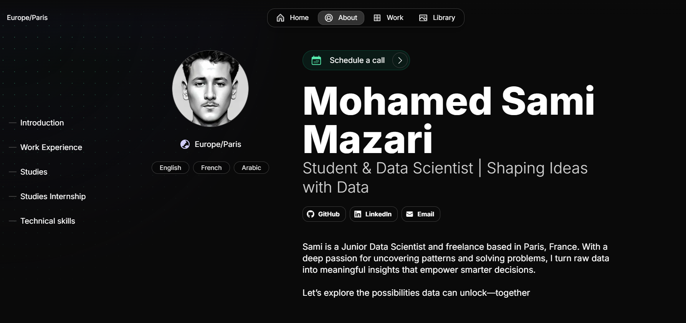

# Sami magic Portfolio

See my portfolio [magic portfolio](https://sami-magic-portfolio.vercel.app/about).




# **Getting started**

Magic Portfolio was built with [Once UI](https://once-ui.com) for [Next.js](https://nextjs.org). It requires Node.js v18.17+.

**1. Clone the repository**
```
git clone https://github.com/once-ui-system/magic-portfolio.git
```

**2. Install dependencies**
```
npm install
```

**3. Run dev server**
```
npm run dev
```

**4. Edit config**
```
src/app/resources/config
```

**5. Edit content**
```
src/app/resources/content (or content-i18n for localization)
```

**6. Create blog posts / projects**
```
Add a new .mdx file to src/app/[locale]/blog/posts or src/app/[locale]/work/projects
```
